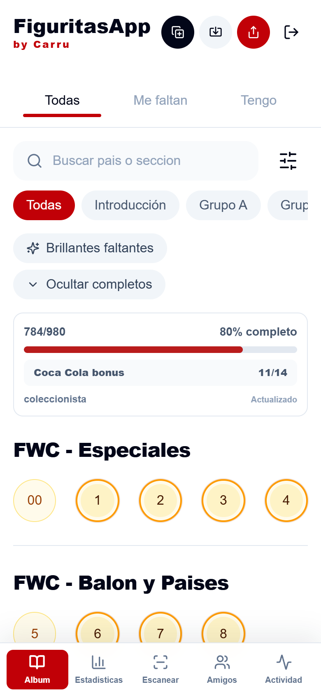
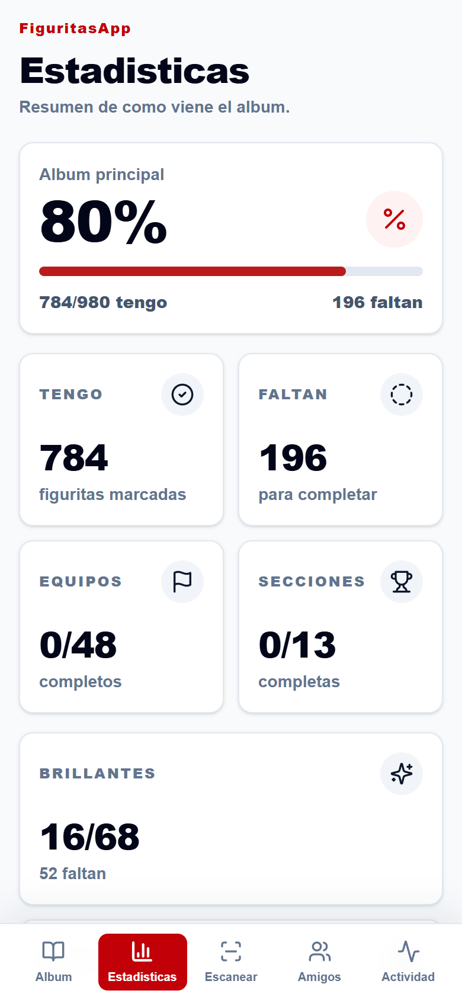
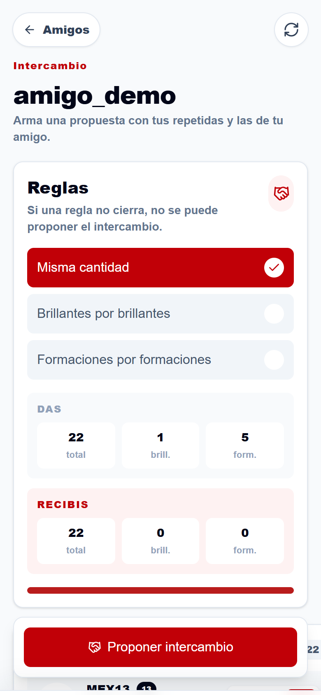

# FiguritasApp

[Español](README.md)

An installable web app to track a World Cup 2026 sticker album, manage duplicates and arrange trades with friends. It started as a way to share a family album and answer an everyday question: **which stickers are we missing?**

**[Open FiguritasApp →](https://figuritasappcarru.vercel.app)** · Free registration required.

## Preview

  
  
  

*Actual interface with fictional demo data. The app's interface is in Spanish.*

## What you can do

- **Track your album:** mark collected stickers, view images and check progress by national team.
- **Manage duplicates and missing stickers:** update quantities, import lists and share them as text.
- **Trade with friends:** compare albums and build proposals using duplicates each person needs.
- **Follow your progress:** view statistics and activity, and receive notifications on compatible devices.
- **Add stickers on mobile:** use the camera scanner or manual entry, and install the app from your browser.

## How it is built

**Next.js · React · TypeScript · Tailwind CSS · Supabase · Vercel**

The **PWA** can be installed on an iPhone without the App Store. **Supabase** provides authentication, PostgreSQL, row-level permissions and realtime synchronization. The scanner processes images in the browser with **OpenCV.js and Tesseract.js**.

## Learn more

[Setup and development](docs/DEVELOPMENT.md) · [Architecture and technical decisions](docs/ARCHITECTURE.md) *(technical guides in Spanish)*

Built by [Francisco Carruthers](https://github.com/FranciscoCarruthers).

*Independent project, not affiliated with Panini, FIFA or Coca-Cola. Third-party trademarks and images belong to their respective owners. The code license has not yet been defined.*
